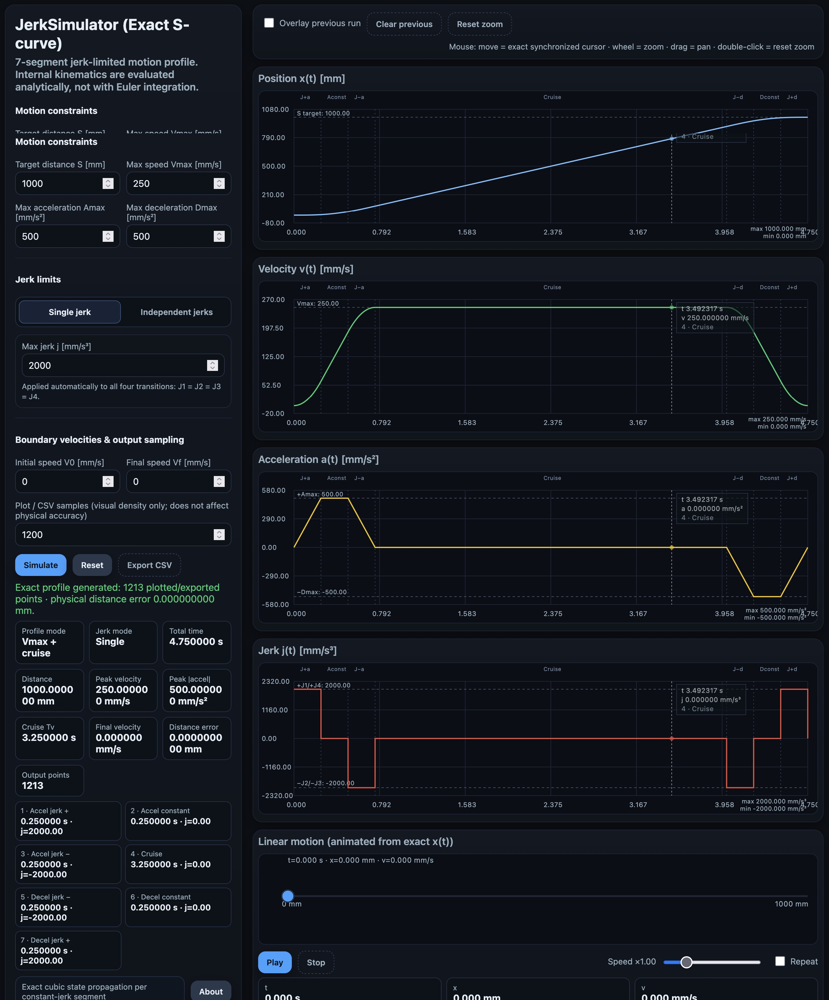

# JerkSimulator

> **Exact jerk-limited S-curve motion profile simulator for industrial automation and motion analysis.**

[](LICENSE)
[](index.html)
[](index.html)
[](https://firerayo.github.io/JerkSimulator/)

**Current application version: V2.1 — Exact S-curve Engine**

---

## 📖 About the project

**JerkSimulator** is a browser-based motion-profile simulator designed to visualize and analyze jerk-limited **S-curve motion**.

The application is intended for automation, PLC, servo, inverter/VFD, conveyor, positioning, and general motion-control work where excessive acceleration, deceleration, or jerk can cause:

- Mechanical shock
- Product movement or instability
- Excessive vibration
- Belt or transmission stress
- Poor positioning behavior
- Excessive current or torque demand
- Drive/inverter alarms caused by overly aggressive ramps

The simulator calculates the complete motion from the configured:

- Target distance
- Maximum velocity
- Maximum acceleration
- Maximum deceleration
- Jerk limits
- Initial velocity
- Final velocity

It then determines automatically whether the motion can reach the requested **Vmax** and include a constant-speed section, or whether the distance is too short and a lower peak velocity must be calculated.

The result is shown as synchronized graphs of:

- Position `x(t)`
- Velocity `v(t)`
- Acceleration `a(t)`
- Jerk `j(t)`

A linear animation and CSV export are also included.

---

## 🚀 Live application

Use JerkSimulator directly in your browser:

### https://firerayo.github.io/JerkSimulator/

No installation is required.

---

## 🖼 Screenshot



---

# ✨ Main features

## Exact analytical S-curve engine

Version 2.x no longer uses fixed-step Euler integration to calculate the physical trajectory.

Each constant-jerk segment is propagated analytically using the exact kinematic equations:

```text
a(t) = a0 + j·t

v(t) = v0 + a0·t + 1/2·j·t²

x(t) = x0 + v0·t + 1/2·a0·t² + 1/6·j·t³
```

Because the motion state is evaluated analytically, the physical result does **not** depend on the graph sampling interval.

This eliminates the discretization error that existed in earlier versions and makes short, high-jerk transitions much more reliable to analyze.

---

## Classical 7-segment jerk-limited profile

The simulator uses the standard seven-segment S-curve structure:

| Segment | Motion phase | Jerk |
|---|---|---:|
| 1 | Acceleration ramp-up | `+J1` |
| 2 | Constant positive acceleration | `0` |
| 3 | Acceleration ramp-down | `−J2` |
| 4 | Constant velocity / cruise | `0` |
| 5 | Deceleration ramp-in | `−J3` |
| 6 | Constant negative acceleration | `0` |
| 7 | Deceleration ramp-out | `+J4` |

Some segments can have a duration of exactly zero.

For example, when the requested velocity can be reached using triangular acceleration/deceleration ramps, the constant-acceleration segments disappear automatically.

Likewise, for short movements the cruise segment can disappear.

---

# 🎛 Motion parameters

## Target distance

```text
Target distance S [mm]
```

Defines the total commanded travel distance.

---

## Maximum velocity

```text
Max speed Vmax [mm/s]
```

Defines the maximum allowed velocity.

The simulator does **not** assume that Vmax will always be reached.

It first calculates the distance required to accelerate and decelerate under the configured limits.

If the movement is long enough:

```text
Acceleration → Vmax → Cruise → Deceleration
```

If the movement is too short:

```text
Acceleration → Reduced peak velocity → Deceleration
```

The reduced peak velocity is solved automatically using a numerical bisection search applied to the **exact analytical motion model**.

---

## Maximum acceleration

```text
Max acceleration Amax [mm/s²]
```

Maximum positive acceleration permitted during the acceleration phase.

---

## Maximum deceleration

```text
Max deceleration Dmax [mm/s²]
```

Maximum magnitude of negative acceleration permitted during the deceleration phase.

Acceleration and deceleration limits are independent.

---

# ⚡ Jerk configuration

Jerk is the rate of change of acceleration:

```text
Jerk = da/dt
```

Units:

```text
mm/s³
```

JerkSimulator V2.1 provides **two jerk modes**.

---

## 1. Single jerk — default mode

This is the standard and simplest configuration.

Only one value is entered:

```text
Max jerk j [mm/s³]
```

That value is automatically applied to all four S-curve transitions:

```text
J1 = J2 = J3 = J4 = Max jerk
```

Example:

```text
Max jerk = 2000 mm/s³
```

Internally:

```text
J1 = 2000
J2 = 2000
J3 = 2000
J4 = 2000
```

This mode is selected automatically when the application starts or when **Reset** is pressed.

It is recommended when the same jerk limit should be used throughout the complete movement.

---

## 2. Independent jerks — advanced mode

This mode allows each transition to have its own jerk limit:

| Parameter | Function |
|---|---|
| `J1` | Acceleration ramp-up: `0 → +A` |
| `J2` | Acceleration ramp-down: `+A → 0` |
| `J3` | Deceleration ramp-in: `0 → −D` |
| `J4` | Deceleration ramp-out: `−D → 0` |

Example:

```text
J1 = 2500 mm/s³
J2 = 1800 mm/s³
J3 = 1400 mm/s³
J4 = 700 mm/s³
```

This allows the beginning and end of the movement to be tuned independently.

A typical industrial use case is keeping a relatively fast acceleration response while making the final settling transition softer.

When switching from **Single jerk** to **Independent jerks**, J1–J4 are automatically prefilled with the current single-jerk value.

---

# 🔄 Initial and final velocity

The simulator supports non-zero boundary velocities:

```text
Initial speed V0 [mm/s]
Final speed Vf [mm/s]
```

Default:

```text
V0 = 0
Vf = 0
```

This makes it possible to analyze motion sections that are part of a larger continuous sequence rather than requiring every movement to start and finish at zero velocity.

The simulator also checks basic physical feasibility.

For example, if the requested distance is too short to transition from V0 to Vf while respecting the configured acceleration, deceleration, and jerk limits, the application reports that the movement is not feasible instead of generating an invalid trajectory.

---

# 🧮 Automatic motion-profile selection

For every simulation, JerkSimulator evaluates the motion constraints and automatically selects one of three conditions:

### Vmax + cruise

The axis reaches Vmax and travels for a period at constant velocity.

```text
Acceleration → Vmax → Cruise → Deceleration
```

### Vmax, no cruise

The available distance is exactly sufficient to accelerate to Vmax and immediately begin deceleration.

```text
Acceleration → Vmax → Deceleration
```

### Reduced peak, no cruise

The target distance is too short to reach Vmax.

The simulator calculates the highest physically feasible peak velocity.

```text
Acceleration → Vpeak < Vmax → Deceleration
```

---

# 📊 Graphs

The application displays four independent canvases:

## Position

```text
x(t) [mm]
```

Shows absolute displacement versus time.

## Velocity

```text
v(t) [mm/s]
```

Shows the actual velocity profile and whether Vmax is reached.

## Acceleration

```text
a(t) [mm/s²]
```

Shows positive acceleration and negative deceleration.

## Jerk

```text
j(t) [mm/s³]
```

Shows the jerk applied during each S-curve transition.

The jerk graph is rendered as a step-type signal because jerk changes instantaneously at the analytical segment boundaries.

---

# 🔍 Interactive graph inspection

The four graphs share the same time reference.

Available controls:

| Action | Function |
|---|---|
| Move mouse over a graph | Synchronized exact time cursor |
| Mouse wheel | Zoom in/out |
| Drag | Pan through the time axis |
| Double-click | Reset zoom |
| **Reset zoom** button | Restore the complete motion |

The synchronized cursor evaluates the exact analytical trajectory at the selected time.

It does not depend on interpolation between graph samples.

---

# 📏 Segment boundaries and reference limits

The graphs include vertical markers for the seven motion segments.

This makes it possible to see exactly where:

- Jerk ramp-up ends
- Constant acceleration begins/ends
- Cruise begins/ends
- Deceleration begins
- Final jerk ramp ends

Reference lines are also displayed for configured limits such as:

```text
Target distance S
Vmax
+Amax
−Dmax
+J1
−J2
−J3
+J4
```

This is useful for verifying visually which constraints are actually reached during a movement.

---

# 🔁 Compare two simulations

Enable:

```text
Overlay previous run
```

to retain the previous profile and overlay it on the current result.

This is useful when tuning parameters such as:

- Jerk
- Acceleration
- Deceleration
- Maximum velocity
- Initial/final velocity

For example, you can reduce `J4` and immediately compare how the softer final jerk transition changes the motion.

Use **Clear previous** to remove the stored comparison profile.

---

# 🎞 Exact linear-motion animation

The application includes an animated representation of the calculated displacement.

The animation uses the same exact analytical `x(t)` model as the profile engine.

Controls include:

- Play
- Pause
- Stop
- Playback speed from `0.25×` to `4×`
- Repeat

Live animation values display:

```text
Time
Position
Velocity
```

---

# 📄 CSV export

Press:

```text
Export CSV
```

to save the calculated motion profile.

The generated CSV contains:

```text
t[s]
x[mm]
v[mm/s]
a[mm/s^2]
j[mm/s^3]
segment
```

The exported values are samples of the exact analytical trajectory.

The number of exported samples is controlled by:

```text
Plot / CSV samples
```

---

# 🎯 Sampling versus physical accuracy

One of the important changes in the exact S-curve engine is that **sampling density is independent of calculation accuracy**.

The parameter:

```text
Plot / CSV samples
```

controls only:

- Graph visual density
- CSV point density

It does **not** change:

- Segment durations
- Peak velocity
- Peak acceleration
- Distance calculation
- Total motion time
- Physical accuracy

Allowed range:

```text
200 to 5000 samples
```

Default:

```text
1200 samples
```

Therefore, long movements do not require millions of integration points.

---

# 🧪 Example

Try:

```text
Target distance = 1000 mm
Max speed       = 250 mm/s
Max acceleration = 500 mm/s²
Max deceleration = 500 mm/s²
Max jerk         = 1000 mm/s³
V0               = 0 mm/s
Vf               = 0 mm/s
```

Using **Single jerk** mode:

```text
J1 = J2 = J3 = J4 = 1000 mm/s³
```

For this particular case:

```text
Amax² / J = 500² / 1000 = 250 mm/s
```

which is exactly equal to Vmax.

The resulting profile is therefore at the boundary between a triangular acceleration profile and a profile containing a constant-acceleration plateau.

The ideal segment durations are:

| Segment | Duration |
|---|---:|
| Accel jerk + | 0.500 s |
| Constant acceleration | 0.000 s |
| Accel jerk − | 0.500 s |
| Cruise | 3.000 s |
| Decel jerk − | 0.500 s |
| Constant deceleration | 0.000 s |
| Decel jerk + | 0.500 s |
| **Total** | **5.000 s** |

Result:

```text
Peak velocity = 250 mm/s
Peak acceleration = +500 mm/s²
Peak deceleration = −500 mm/s²
Distance = 1000 mm
Total time = 5 s
```

---

# 🔧 How to use

1. Open the application.
2. Enter the target distance.
3. Enter Vmax.
4. Enter Amax.
5. Enter Dmax.
6. Select the jerk mode.
7. Enter either one global jerk value or four independent jerk values.
8. Optionally configure V0 and Vf.
9. Select the desired graph/CSV sample count.
10. Press **Simulate**.
11. Inspect the position, velocity, acceleration, and jerk graphs.
12. Use the synchronized cursor, zoom, or pan for detailed analysis.
13. Optionally compare the result against the previous run.
14. Use the animation to visualize the displacement.
15. Export the result to CSV if required.

---

# 🆕 What's new in V2.1

Compared with the original implementation, the current version introduces major changes to both the calculation engine and the user interface.

### Calculation engine

- ✅ Replaced Euler numerical integration with exact polynomial state propagation
- ✅ Exact position, velocity, and acceleration inside every constant-jerk segment
- ✅ Automatic Vmax/cruise determination
- ✅ Automatic reduced-peak calculation for short moves
- ✅ Independent acceleration and deceleration limits
- ✅ Optional non-zero V0 and Vf
- ✅ Four independent jerk transitions
- ✅ Default single-jerk mode with automatic J1–J4 synchronization
- ✅ Physical-feasibility checks for short movements
- ✅ Sampling density decoupled from physical accuracy
- ✅ Safe peak/minimum calculations without spreading large arrays

### User interface and graphs

- ✅ Single jerk / Independent jerks selector
- ✅ Four synchronized graphs
- ✅ Exact synchronized time cursor
- ✅ Seven-segment boundary markers
- ✅ Configured-limit reference lines
- ✅ Zoom and pan
- ✅ Previous-run overlay
- ✅ Reset zoom
- ✅ Exact linear-motion animation
- ✅ Playback-speed control
- ✅ Repeat animation mode
- ✅ Segment-duration summary

### Reliability

- ✅ Correct CSV line endings
- ✅ Reset clears the stored simulation and animation state
- ✅ Fixed large-array `Math.max(...array)` / `Math.min(...array)` failure mode
- ✅ Long-duration moves no longer require huge arrays
- ✅ Graph/CSV sample count is bounded and configurable

---

# 🧠 Why exact analytical calculation matters

Earlier numerical integration approaches approximate the trajectory by repeatedly advancing the state using a small time interval.

That approach creates a tradeoff:

```text
Smaller dt → more points → higher CPU/memory cost → lower numerical error
Larger dt  → fewer points → lower CPU/memory cost → higher numerical error
```

For a constant-jerk segment, this tradeoff is unnecessary because the trajectory has a known analytical solution.

JerkSimulator V2.x therefore separates:

```text
Physical motion calculation
```

from:

```text
Graph / CSV sampling
```

The physical trajectory is solved first.

Only afterward is it sampled for visualization and export.

This is especially important when analyzing:

- High jerk values
- Very short jerk transitions
- Long travel distances
- High-resolution exports
- Motion profiles close to constraint boundaries

---

# 🏭 Typical applications

JerkSimulator can be useful for preliminary analysis of:

- Conveyor motion
- Servo positioning
- Linear axes
- Elevators
- Pick-and-place mechanisms
- Packaging machinery
- Palletizers
- Gantries
- Automated transfer systems
- VFD/inverter-driven movements
- PLC motion sequences
- Mechanical systems sensitive to shock or vibration

It can also help compare how changing acceleration, deceleration, and jerk modifies the shape and duration of a motion before applying parameters to a real machine.

---

# ⚠️ Engineering note

JerkSimulator is an analysis and visualization tool.

A real machine can be affected by factors not represented by the ideal kinematic model, including:

- Motor torque limits
- Drive current limits
- Load inertia
- Gearbox backlash
- Belt elasticity
- Mechanical resonance
- Friction
- Brake behavior
- PLC scan time
- Network update time
- Servo loop configuration
- Drive-specific S-curve algorithms
- Manufacturer-specific ramp definitions

Therefore, calculated values should be validated against the actual machine, drive documentation, safety requirements, and commissioning procedures before being used in production.

---

# 💻 Technology

The application is implemented using:

- HTML5
- CSS
- Vanilla JavaScript
- HTML Canvas

No framework or external runtime is required.

The complete application is contained in:

```text
index.html
```

This makes it easy to:

- Run locally
- Host with GitHub Pages
- Copy between computers
- Use offline after downloading the file
- Inspect or modify the source code

---

# 🌐 Browser usage

JerkSimulator is designed for modern web browsers on desktop or mobile operating systems.

For best results, use an up-to-date version of a modern browser such as:

- Chrome / Chromium
- Microsoft Edge
- Firefox
- Safari

---

# 📦 Run locally

Clone the repository:

```bash
git clone https://github.com/FireRayo/JerkSimulator.git
cd JerkSimulator
```

Then open:

```text
index.html
```

in your browser.

Because the application is self-contained, no build step, package manager, web server, or installation process is required for normal use.

---

# 📁 Repository

GitHub:

https://github.com/FireRayo/JerkSimulator

Live application:

https://firerayo.github.io/JerkSimulator/

---

# 📜 License

This project is distributed under the **GNU General Public License v3.0 (GPL-3.0)**.

See:

[LICENSE](LICENSE)

for the complete license text.

---

# 👤 Author

**FireRayo**

GitHub:

https://github.com/FireRayo

---

## JerkSimulator V2.1 — Exact S-curve Engine

**Exact motion calculation. Independent jerk control. Interactive analysis. Single-file HTML5 application.**
